## React Deployment with Heroku

- Go to heroku.com

- Create an account

- Check your email and click on the link

- Choose a password then login

- Create an app (click on New on the up right side)

- Choose a name (unique)

- Click on install Heroku-CLI then choose the installer for your OS and install it

- Go to your project

- Open the terminal from VS Code

- type:
```
heroku login
```
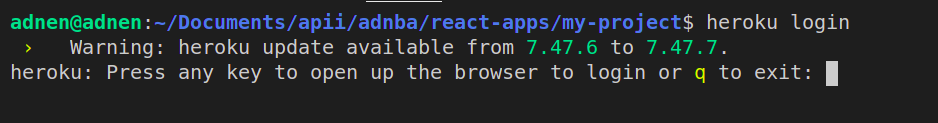

- press on any key and the login page will open in browser

- Login in browser
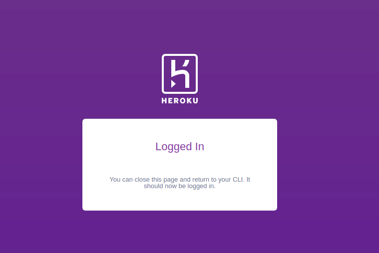


- Go back to VS Code terminal and type:
```
heroku git:remote -a name-of-app        # replace "name-of-app" with the name you chose for your app when creating it
```
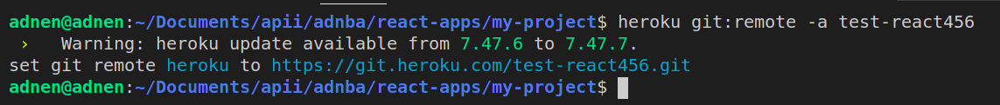

```
heroku buildpacks:set mars/create-react-app
```
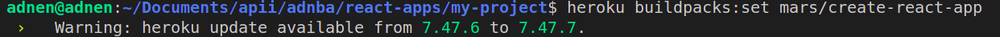
```
git add .
```
```
git commit -am "first heroku commit"
```
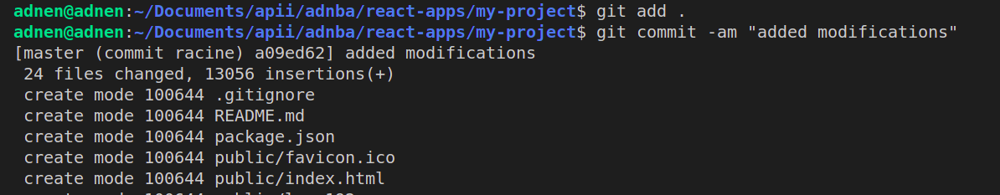


- and finally:
```
git push heroku main
```
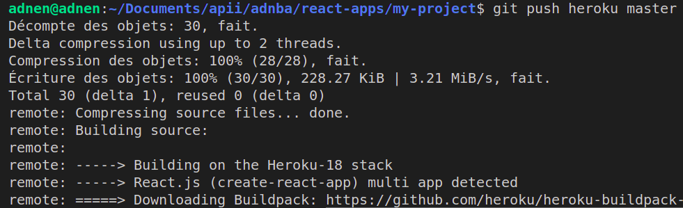

- he will give you the link at the end of the operation which will look like this:
```
https://name-of-app.herokuapp.com
```

- Open that link to see your project !


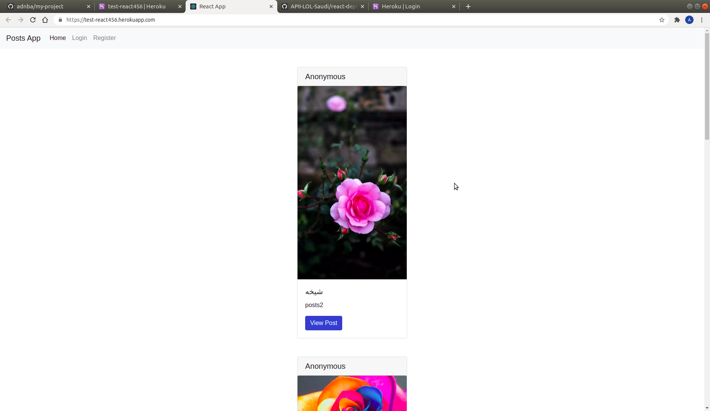

- And that's it.

Next time you just need to either:
```
git push heroku main
```
after you commit

**Note**: make sure the default branch is main or master

or if you are using Github Desktop then just Push normally ;)


## Deploy using Netlify:

install netlify cli

like this in terminal:
```
npm install -g netlify-cli
```
then enter to your project and build it

using:
```
npm run build
```

or: 
```
yarn build
```

if you are using yarn

then deploy it to netlify:
```
netlify deploy
```

* _Note:_ if you are using Windows with Powershell terminal you can get this error:

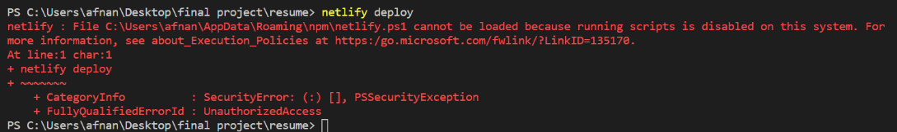

* to fix this, you can put this command then try deploy again:

```
Set-ExecutionPolicy -Scope CurrentUser -ExecutionPolicy Unrestricted
```
- it will open the browser to login

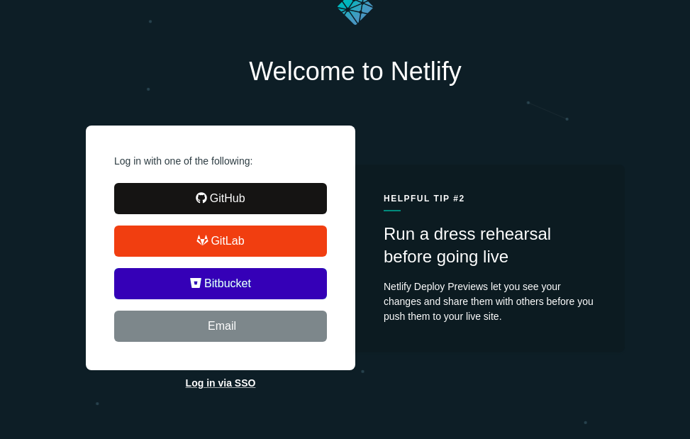

- you can choose Github for example

- or create a new account using your email

- select "Create & configure a new site" using the arrow key

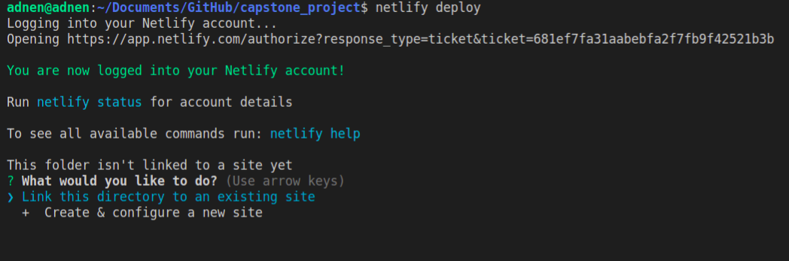

- press enter for the team

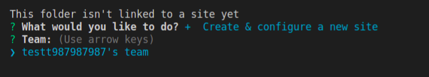

- choose a unique name (if the name is taken you can retry)

the name should not contain spaces

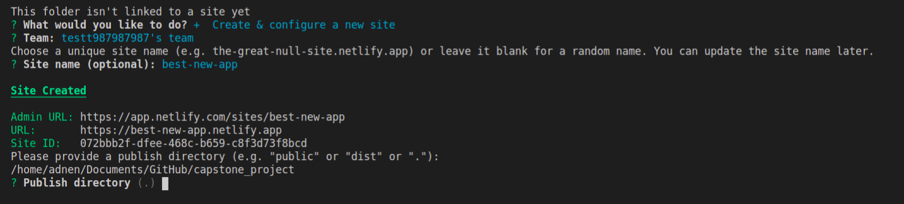

- type `build` for Publish directory then press enter

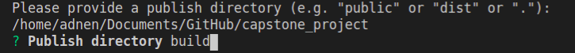

- you can open `Website Draft URL`

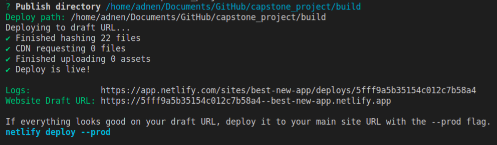

I hope it looks fine

if you like you can make it official by getting the production link

- by typing:
```
netlify deploy --prod
```

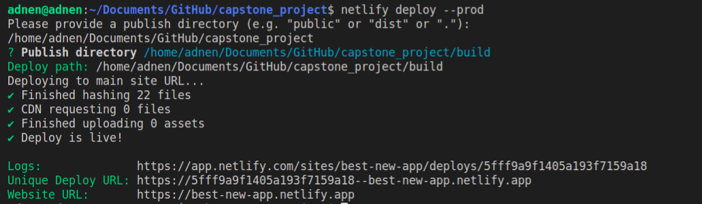

- open the `Website URL`

;)
